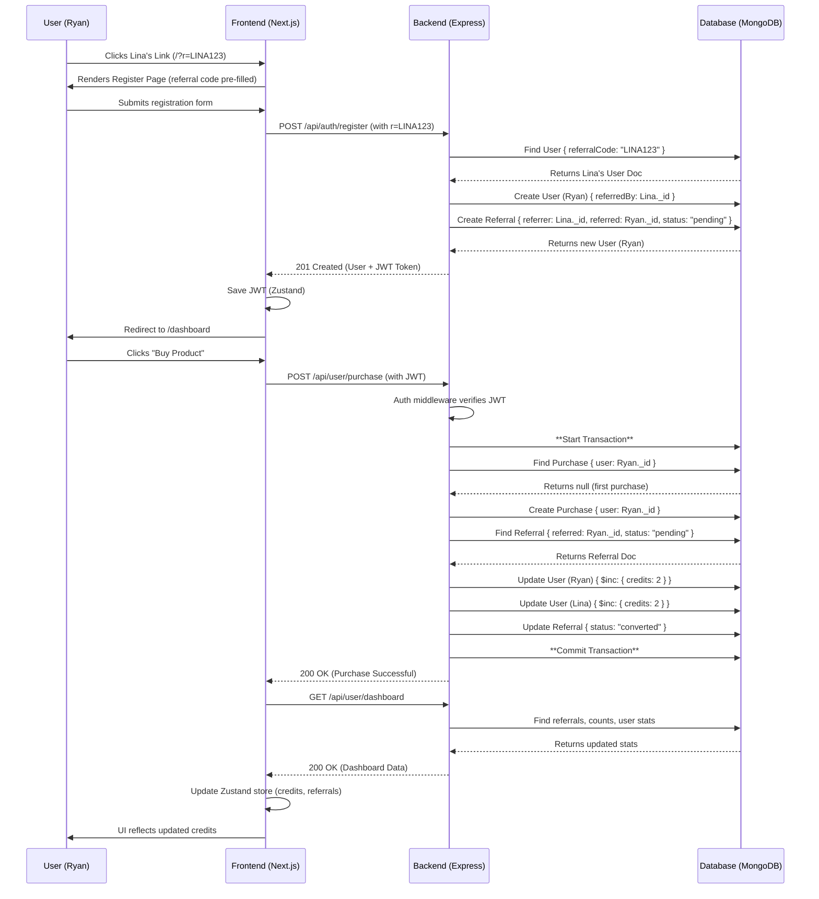

# Full Stack Referral & Credit System

A full‑stack referral and credit system. Users can sign up, share referral links, and earn credits when referred users make their first purchase. Built with a Next.js/TypeScript frontend and an Express/TypeScript backend with MongoDB (Mongoose).

## Tech Stack
- Frontend: Next.js, React, TypeScript, Tailwind CSS (v3), Zustand, Framer Motion, Axios  
- Backend: Node.js, Express, TypeScript, MongoDB (Mongoose), JWT, bcrypt  
- Database: MongoDB

## Features
- User registration & login (JWT)
- Referral codes and referral links
- Tracking referrals and purchases
- Atomic credit awarding on a referred user's first purchase (MongoDB transactions)
- Protected API routes requiring authentication

## Getting Started

This repository is a monorepo with two folders: `client` and `server`. Run both concurrently.

Prerequisites:
- Node.js (recommended LTS)
- MongoDB (local or remote)

### Clone repository
1. Open PowerShell / Terminal and choose a directory:
   cd C:\Path\To\Where\You\Want\Projects
2. Clone the repo and enter the folder:
   git clone <repo_url>
   cd "Referral & Credit System"

### Backend (server)
1. Open PowerShell / Terminal:
   cd server
2. Install dependencies:
   npm install
3. Copy `.env.example` → `.env` and fill values.
4. Start in development:
   npm run dev

Default backend URL: http://localhost:5001

### Frontend (client)
1. In a second terminal:
   cd client
2. Install dependencies:
   npm install
3. Copy `.env.local.example` → `.env.local` and fill values.
4. Start dev server:
   npm run dev

Default frontend URL: http://localhost:3000

## Environment Variables

Server (`server/.env.example`)
```text
PORT=5001
MONGO_URI=mongodb://127.0.0.1:27017/filesure-referral
JWT_SECRET=your_jwt_secret_here
CLIENT_URL=http://localhost:3000
```

Client (`client/.env.local.example`)
```text
NEXT_PUBLIC_API_URL=http://localhost:5001/api
```

## Architecture & Business Logic

High level:
- Client (Next.js) handles UI, authentication state (Zustand), and attaches JWT via Axios interceptor.
- Server (Express) exposes RESTful endpoints; uses Mongoose models: User, Referral, Purchase.
- Core logic ensures credits are only awarded once per referred user’s first purchase using MongoDB transactions.

Referral flow:
1. Referrer (e.g., Lina) registers and receives a unique `referralCode` (e.g., LINA123).
2. Referrer shares link: `http://localhost:3000/register?r=LINA123`.
3. New user (referred) signs up; backend stores `referredBy` and creates a Referral document (status: `pending`).
4. When the referred user makes their first purchase:
   - A MongoDB transaction checks for existing Purchase documents.
   - If first purchase, it:
     - Creates the Purchase document.
     - Increments credits for both referrer and referred (e.g., +2).
     - Updates Referral document to `converted`.
   - If any step fails, the transaction is aborted to preserve consistency.

## API Overview

- POST /api/auth/register — Public — Register user (optional referralCode)
- POST /api/auth/login — Public — Login and get JWT
- GET /api/user/dashboard — Protected — Get logged-in user's stats (referrals, converted, credits, link)
- POST /api/user/purchase — Protected — Simulate a purchase (triggers credit logic)

## Development Tips
- Ensure the auth middleware attaches `user` to `req` and add proper TypeScript declaration merging so `req.user` is recognized.
- Use `npm run dev` in `server` to run `nodemon` + `ts-node` for hot reload during backend development.

Here is the final documentation needed to complete your submission.

1. Environment Example Files (.env.example)
You need to create these two files in your repository. They list the required environment variables without the secret values.

📁 server/.env.example
(Create this file in your server folder)

# The port for the backend server
PORT=5001

# Your MongoDB connection string
MONGO_URI=mongodb://127.0.0.1:27017/filesure-referral

# A secret string for signing JSON Web Tokens
JWT_SECRET=your_jwt_secret_key_here

# The URL of the frontend (for creating referral links)
CLIENT_URL=http://localhost:3000
📁 client/.env.local.example
(Create this file in your client folder)

# The base URL for the backend API
NEXT_PUBLIC_API_URL=http://localhost:5001/api
2. System Design Documentation
This is the "UML diagram" and data flow explanation. You should add this entire section to your main README.md file.

## Contributing
Open PRs with clear descriptions. Run lints/tests (if present) before submitting.

## System Design & Data Flow

This diagram shows the sequence of events for the most critical user flow: a new user (Ryan) signing up with a referral code from an existing user (Lina) and making their first purchase.

Referral & First Purchase Sequence Diagram (Mermaid)


## License
MIT